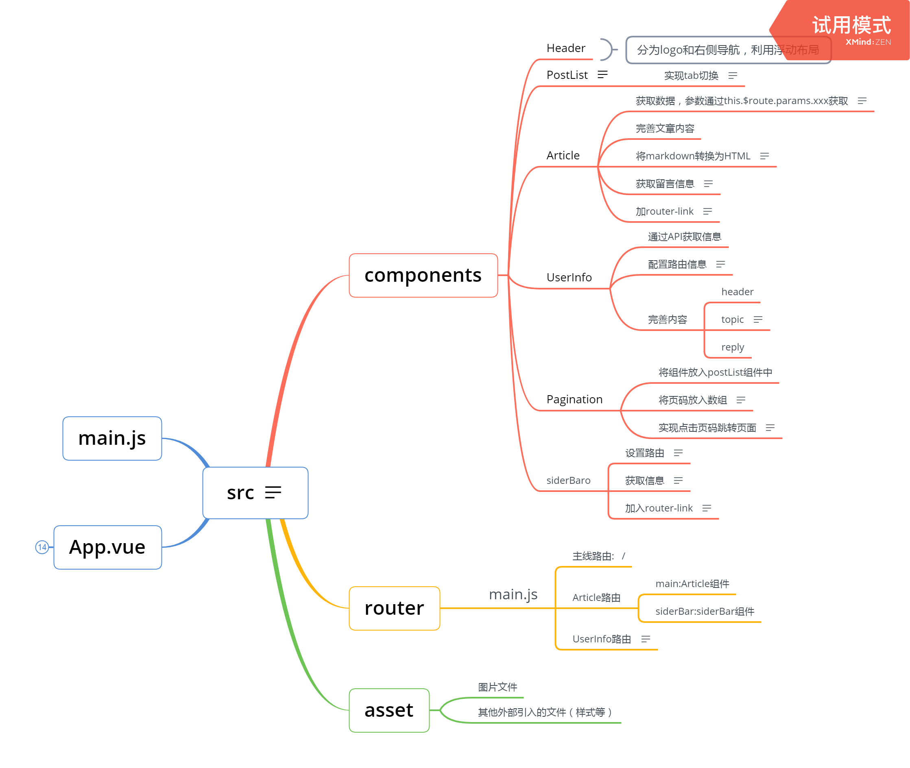

# cnode
> A Vue.js project
本项目实现了浏览首页，tab切换，浏览详情页，获取用户评论信息，浏览用户个人信息页
目前用到的技术栈包括，ES5，ES6，vue，vue-router，HTML5，CSS3
## Build Setup

``` bash
# install dependencies
npm install

# serve with hot reload at localhost:8080
npm run dev

# build for production with minification
npm run build

# build for production and view the bundle analyzer report
npm run build --report
```
# 项目思维导图
 
# 流程介绍
# src

首先，新建vue项目
在项目文件夹中使用命令行输入
```
npm init webpack cnode
cd cnode
npm installnnpm 
npm run dev
```

接下来进入项目中的src文件夹

## components

### Header

### PostList

使用v-if渲染loading.gif，当页面挂载未完成，isLoading为true，挂载完成，isLoading为true（后面考虑挂载在APP组件上）
通过API获取首页信息，传递tab，page，limit参数,
调整样式，统一元素绑定不同的样式,
加入router-link并绑定参数，获取文章详情

- 实现tab切换

  1.获取postList需要传入参数tab，当点击对应的tab时，切换分类，方法同pagination

### Article

- 获取数据，参数通过this.$route.params.xxx获取

  this.$http.get(
              `https://cnodejs.org/api/v1/topic/${this.$route.params.id}`
            )

- 完善文章内容
- 将markdown转换为HTML

  引入外部样式
  ```
  npm install github-markdown-css
  ```
  引入样式，在需要加入样式的地方绑定class
  ```
  import 'markdown-github-css'
  <div class="markdown-body" v-html="xxx"></div>
  ```

- 获取留言信息

  1.页面中显示作者，使用v-if或v-show

- 加router-link

  导航到userInfo组件，参数为name

### UserInfo

- 通过API获取信息
- 配置路由信息

  {
  path:'/user/:name',
  name:'user_Info',
  components:{
    main:UserInfo
  }
  }
  注意：路径自己配置
  name格式

- 完善内容

	- header部分
	- topic部分

	  1.用计算属性，仅返回5个topic，注意，计算属性没有参数，返回值直接在v-for中可供遍历

	  2.关于icon-font图标的使用，需要将文件复制到本地，在src下新建文件夹，专门放icon文件，在main.js中引入，在对应文件中使用标签

	- reply

### Pagination

- 将组件放入postList组件中
- 将页码放入数组

  1.将页码放入数组[1,2,3,4,5,'...']

  2.引入jQuery

  3.给页码绑定样式，当前页码为点击的页码，就加上active的样式，

  4.点击加上样式
  ```
  <div @click="changePage(page)">
  changePage(){
    this.currentPage = page
  }
  ```
  5.点击上一页，下一页，首页，跳转到页面
  ```
  switch(page.currentTarget.innerHTML){
    case 'yyy'
    code...
    break;
  }
  ```
- 实现点击页码跳转页面

  1.首先，在pagination中触发事件，在PostList中接收事件，并且，将传过去的值作为自己的值
  ```
  this.$emit('xxx',this.currentPage)
  ```
  ```
  <pagination @xxx="yyy"></pagination>
  yyy(value){
    this.page = value
  }
  ```

- 修改样式

  今日bug：
  用jq触发a标签失败
  a标签被触发click事件其实是因为里面的文字被点了，
  如果你直接$("a").click()
  是无效的，你如果想要触发a标签，最好是在a标签里面加一个文字添加能被JS捕获的元素，比如加一个span，然后点击span

### SiderBar

- 设置路由

  设置一个路由下多个组件，
    {
        path:'/topic/:id &author=:name',
        name:'post_content',
        components:{
          main:Article,
          SliderBar:SliderBar
        }
      },
  另外，在APP中，需要有路由视图，
  写法如下
  ```
  <router-view name="SliderBar"></router-view>
  ```
- 获取信息

  大致同UserInfo，通过loginname
  另外，获取首页信息，同PostList的API，通过forEach方法，或者for循环，遍历所有的内容，获取其中没有评论的项，通过计算属性，只返回5个

- 加入router-link

  1.头像和名字加上路由，跳转到详情页

  2.主题加上router-link，跳转到不同的Article组件，注意，要在Article组件中加入监听

  3.无人回复的主题路由不仅要跳转到不同的Article组件，也要跳转到不同的sliderbar，前者参数是id，后者的参数是author.loginname

## router

### main.js

- 主线路由:   /
- Article路由

	- main:Article组件
	- siderBar:siderBar组件

- UserInfo路由

  1.注意路由的path可以自己定义

  2.注意路由的名字，需要是xxx_xxx

## asset

### 图片文件

### 其他外部引入的文件（样式等）

## App.vue

## main.js


For a detailed explanation on how things work, check out the [guide](http://vuejs-templates.github.io/webpack/) and [docs for vue-loader](http://vuejs.github.io/vue-loader).
